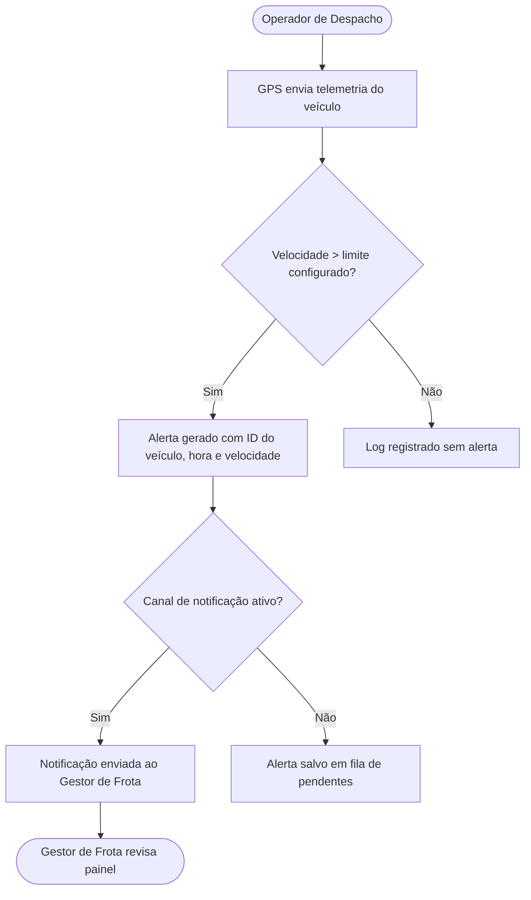

# Diagrama de fluxo - Épico: Monitoramento de Velocidade (RouteWise)
> **Ahirton Lopes · PM AI Toolkit**
> **Artefato de Demo - Módulo 1.1**

> **Artefato de Demo - Módulo 1.1**
> Diagrama de fluxo gerado pelo Requirements Copilot. Output de referência para a demo.

Output gerado pelo Requirements Copilot a partir da transcrição `transcricao-discovery-routewise.md`.

O nó "Canal de notificação ativo?" representa uma dependência técnica que não apareceu na transcrição — o modelo sinalizou como `[AMBIGUIDADE]` nas Perguntas em Aberto. Esse é exatamente o comportamento esperado do Protocolo de Ambiguidade: o modelo não inventou uma solução, ele expôs a lacuna.

No Módulo 1.3 você vai ver o output completo que gerou esse diagrama e como tratar essas flags antes do sprint planning.

---

*Ahirton Lopes · PM AI Toolkit — UNIPDS: Ferramentas de IA para Gestão de Projetos*
*Prof. Ahirton Lopes, Ph.D. — GDE AI, Microsoft MVP, Senior Manager*
